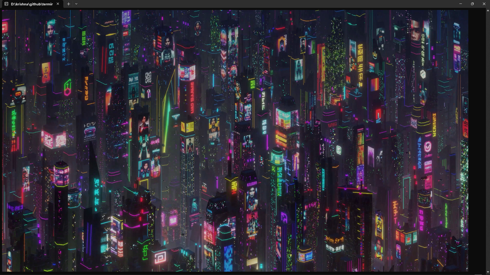
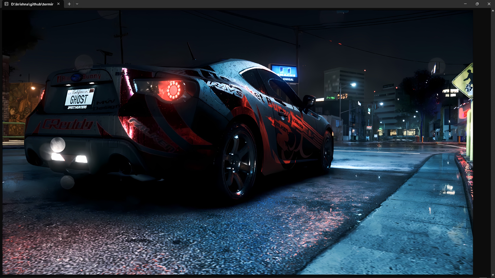

# Terminal image viewer 

- in this program you can view any image in windows terminal using ascii text
- this program use ascii text "▀" to display image in terminal
- i have used std_image library to decode images
- smaller the text size , higher the image resolution!

# how to use this program?

- there are 2 render options "image render" and "image render v2"

- use "w" and "s" key to move selecter , press space key to open selected window

- in image render you have to set the text size before rendering the image to make it fit in your terminal , when you enter text resize window a message will popup , it will tell you instruction  , after clicking space the message popup will exit , you will see a red/green screen depends on your image size , if your screen is red then the image cant fit in your terminal , you should make your text size small by pressing "ctrl -" until it becomes green . but if your screen does not becomes green at smallest text size then you can still render image but it will be scaled to fit in your terminal window!

- image render v2 is advance version of image render , in this you dont have to set the text size before rendering , it will render your image in your current text size , but if you change your text size then this program will adjest the image quality to your text size , if you make your text size very small then it will increase the quality of image , but if you make it very large then image quality will also decrease !

- there are some options in settings , "render cube size" , "print cube size" , "diagnose"

- use "w" and "s" keys to move selecter , press space to edit selected setting , once you press space key to edit the selected settings a window will appear asking for data , you can enter your desire data and press space again to confirm

- render cube size is the data which decide how much pixels each thread should process to render , if render cube size is 100 , then each thread will process 100*100 pixels.

- print cube size is the data which decide how much pixels each thread  should process to convert pixels data to print format , if print cube size is 100 , then each thread will process 100*100 pixels.

- diagnose => i have created this to test how much times does it take to render a image in diffrent render cube size and print cube size.

# how this program works?

- i have used similar trick in [york](https://github.com/kuratus89/york)
- this whole program runs on main loop in main.cpp
- i implemented a uniqe way to manage windows , each window has its own screen and all window are being stored in a stack ! , and the top most window in stack will be loaded for output !

## how display system works? , how do i change the displayed text to some other text?

- if you have printed a text "hello world" but now you want to change it to "bye world" what will you do?? how can you change "hello world" to "bye world" which was already printed in terminal?

- there are 2 ways to do that , i called them hard clear and soft clear

- hard clear => in this method we erase all text in terminal and print another text which we want to display , in above case we can print "bye world" after doing hard clear , the text which were printed before hard clear will be cleared and hence only text which were printed after hard clear will be displayed . it sounds very good but there is problem in this method , that it takes too much time to clear terminal , why? everytime you use this method the terminal make a new process and terminate the old process . if you use this method to clear screen you screen will seems like flickering . command to use hard clear -> "system("cls");"
  
- soft clear => compare to hard clear this method is very fast  , but do you know this method does not clear the terminal screen . then how do we erase the old text and print new text?? in this method you move the cursor to top left position of terminal , what will happen from that?? once you print the text after soft clear , you text will be printed from top left position , and if there is old text in that place , it will be overwritten by new text ! , example -> you print "1" and now you want to change it to "2" , you do a soft clear and now you pointer is back to its starting position and you once you print "2" , "1" will be over written by your new text "2" .but there is 1 problem in this method also . in our above case , if you want to change "hello world" to "bye world" when you try this method on this,  the output will be "bye worldld" ,why? coz "bye world" is 2 length short then "hello world" , when you print "bye world" after soft clear, only first 8 characters will be overwritten by new text , "hello world" has 2 more character so its last 2 character will remain in screen! , so whats the solution? , just print "bye world  " (<- i have added 2 space character in last) this is as same length as "hello world" so there will be no problem. command to use soft clear ->"std::cout<<"\033[H";"

- now you know how i change the text which was already printed .

## how do i display images in terminal?
i will explain in very short->
- first i store all rgb values of all pixels of image use "stb image" library
- then i print each pixel , how do i print pixels? ,  i use this character "▀" to print pixels i color the text to that of pixel and set the background color to pixel which is below this pixel ,so when i print "▀" the upper pixel color will be displayed due to text color but the lower pixel color will also be displayed due to background color , so i can print 2 pixels from 1 character
  

# here are some screenshots and screenrecording

if you want to ask about something or want to improve this program then please contact me in discord , [discord server link](https://discord.gg/PC8NWDr2Mv) 

